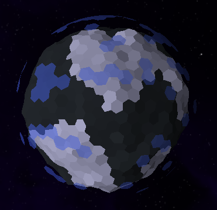

# Themelight Star System

## An example Mindustry mod with a JSON planet (and a star!).

\+ Well documented for newbie modders.

\+ Contains (almost) every single field you can declare in your own planet or star.

\+ Supports newer planet features recently added to the modding API.

\- Not meant to be played.

### Authored by [Slotterleet](https://github.com/Slotterleet/)
